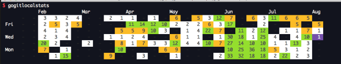

# Git Contribution Visualization

This project is a Go-based command-line tool that scans Git repositories in a specified folder, collects commit statistics for a specified email, and generates a contribution graph for the last 6 months. The program generates a visual output of the contributions made to the repositories, similar to the contribution graphs seen on GitHub profiles.

## Features

- **Scan for Git repositories**: You can recursively scan a folder for all Git repositories.
- **Commit statistics**: Collect and display the number of commits for a specified email in the last 6 months.
- **Contribution graph**: A weekly view of your Git activity, visualized using colored cells based on commit frequency.
- **Custom folder scan**: You can add new folders to scan for Git repositories.

## How it Works

The program scans for all repositories inside a specified folder (or recursively looks in subfolders). It tracks the commits made by a specific email address over the last 6 months and generates a contribution graph based on these commits.

## Prerequisites

- Go 1.18 or higher
- The `go-git` library for accessing Git repositories (used for repository and commit access)

### Required Dependencies

To install the necessary dependencies for the project, run:

```bash
go mod tidy
```

## How the graph will look like:

